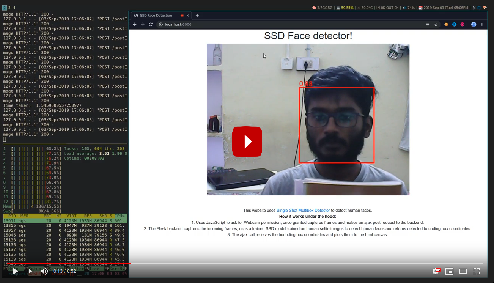

# Face Detection using SSD

This is a web app which uses Single Shot Multibox detector (SSD) framework to detect human faces in a live feed of webcame.

## How it works:

1. The web app uses JavaScript to ask for Webcam permission, once granted it captures frames and sends them to the Flask backend via an AJAX post request.
2. The Flask backend captures the incoming frames, uses the SSD model (trained on human selfie images) to detect human faces and returns detected bounding box coordinates.
3. The ajax call receives the bounding box coordinates and plots them onto the html canvas.

## Demo:

The model is running on CPU, so the response time is a bit slow.

## Requirements

* Pytorch (0.4.1)
* Torchvision (0.2.1)
* Numpy
* Pillow

## Instructions

To run the application:

* Install requirements using `pip installl -r requirements.txt`
* `python app.py`
* Visit `localhost:6006` on your Google Chrome browser.

Note: Please use Google Chrome, this app has some issues running on Firefox.

## References:

The SSD code is adapted form of original open source ssd.pytorch implementation which can be found [here](https://github.com/amdegroot/ssd.pytorch/).

